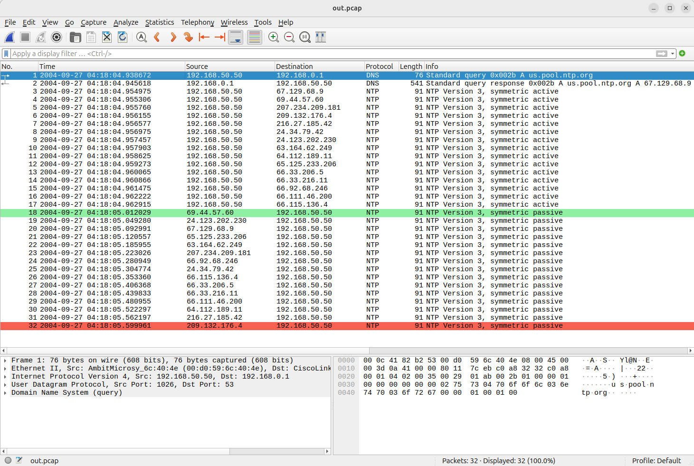

title: Comparing PCAP Files
date: 2025/05/04
description: A utility to highlight differences between two PCAP files, with the output viewable directly in Wireshark.
main_image: pcap_diff.svg

## Overview
There are several tools available for comparing the differences between two PCAP files, but surprisingly, none of them output their results in a format that can be usefully viewed within Wireshark. Additionally, unlike other file types, comparing PCAP files often requires ignoring certain parts of a packet that can change during transmission (such as MAC addresses and IP TTL values). Most existing solutions offer limited flexibility for handling this. Finally, no existing tool allows for comparing PCAPs that were captured at different link layers i.e. an IPv4 PCAP with an Ethernet PCAP, or an Ethernet PCAP with a WiFi PCAP.

To solve these problems I wrote a new tool named [PCAP Diff](https://github.com/jgibbard/pcap_diff).

## Features

- ⚙️ Byte Masking: Exclude dynamic fields like TTL, checksums, and counters from comparisons.

- 📦 Custom Byte Ranges: Specify which byte ranges to compare in each file. Ideal for ignoring headers or handling different encapsulation/link layers.

- 🦈 Wireshark Compatible Output: Generates a PCAP file that is viewable in Wireshark with colour highlighting.

- ⏳  Flexible Comparison Modes: Choose between full file search or timestamp-windowed comparison.

# Usage
Full usage details are provided in the [README file on Github](https://github.com/jgibbard/pcap_diff).

# Screenshot
The example below shows the result of comparing two files: `File A` and `File B`. `File A` contains one packet that is not in `File B` (highlighted in red), and `File B` contains one packet that is not in `File A` (highlighted in green). The rest of the packets are the same in both files.

{.image_responsive .image_shadow .image_800px .image_centred}