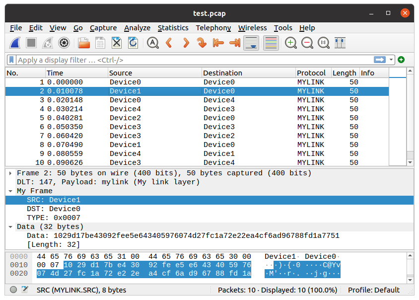

title: Making Wireshark Link Layer Dissectors
date: 2021/11/14
description: Wireshark is a powerful tool for analysing communications data. While it is typically used for ethernet traffic, Wireshark can be used to decode any arbitrary protocol. This article covers how to make custom link layer dissectors using the Lua scripting language.
main_image: wireshark_lua_user_link_layer.svg

## Overview
While Wireshark is typically used for ethernet traffic, it can also be used to decode any arbitrary protocol. All PCAP files specify which link layer is used in the [PCAP global header](https://wiki.wireshark.org/Development/LibpcapFileFormat){target="_blank"}. Ethernet has a link-layer value of `1`, but there are over 100 other standardised types defined. Sixteen link layer values are reserved for user use; these are named `DLT_USER0 (147)` through to `DLT_USER15 (162)`. A full list of all supported link layers can be found [here](https://www.tcpdump.org/linktypes.html){target="_blank"}. 

### Lua Scripts
The functionality of Wireshark can be easily extended by using the Lua scripting language to create protocol dissectors. Typically these are written to dissect custom Ethernet or IP packets, but they can just as easily be used to dissect data at the link layer too.

An excellent guide to creating Wireshark protocol dissectors in Lua can be found [here](https://mika-s.github.io/wireshark/lua/dissector/2017/11/04/creating-a-wireshark-dissector-in-lua-1.html){target="_blank"}.

Lua scrips saved in ```~/.local/lib/wireshark/plugins``` will be automatically loaded by Wireshark. Alternatively the ```-X lua_script:my_lua_script.lua``` option can be used to temporarily load a script when running Wireshark from a terminal.

### User DLT Table
When a PCAP file has a `DTL_USER*` link layer specified, Wireshark looks up in its ```User DLT Table``` to identify which protocol dissector to use.

To set up the ```User DTL Table```, first make sure any custom Lua dissectors are loaded in Wireshark, then go to ```Edit -> Preferences -> Protocols -> DLT_USER -> Encapsulations Table (Edit)```. Select ```+```, pick the desired ```DLT``` from the drop down box, enter the name of the protocol dissector that understands the link layer, and finally press ```Ok```.

Alternatively, if you just want to temporarily load a dissector script and link it to a DLT user link layer, then you can use the following command:

```bash
wireshark -X lua_script:<name_of_script>.lua -o "uat:user_dlts:\"User 0 (DLT=147)\",\"<name_of_link_layer_dissector>\",\"\",\"\",\"\",\"\""
# E.g. If my_script.lua had a dissector for "myprotocol", and you wanted to use DLT_USER3,
# then you would use the following command:
wireshark -X lua_script:my_script.lua -o "uat:user_dlts:\"User 3 (DLT=150)\",\"myprotocol\",\"\",\"\",\"\",\"\""
```

## Example
For this example I have made up an demo protocol with the following specification:
```
source: NULL terminated string
destination: NULL terminated string
type: UINT16, Big Endian
data: 32 bytes of data
```

### Generating a PCAP file with a custom link layer
The following Python script will generate a PCAP file containing data structured as specified in the protocol defined above.

```python
#!/usr/bin/env python3

# import module
import struct
import time
import random
import os

# PCAP file settings
# https://wiki.wireshark.org/Development/LibpcapFileFormat
MAGIC_NUMBER = 0xA1B2C3D4 
VERSION_MAJOR = 2
VERSION_MINOR = 4
THISZONE = 0 # GMT to local correction
SIGFIGS = 0 # Accuracy of timestamps
SNAPLEN = 65535 # Max packet length
NETWORK = 147 # Data link type. 147 = DLT_USER0, 148 = DLT_USER1, etc.
PCAP_GLOBAL_HEADER_FORMAT = '@ I H H i I I I' # @ = System Endian
PCAP_PACKET_HEADER_FORMAT = '@ I I I I'

class Pcap:

    def __init__(self, filename,):
        self.pcap_file = open(filename, 'wb')
        self.pcap_file.write(
            struct.pack(PCAP_GLOBAL_HEADER_FORMAT, MAGIC_NUMBER, VERSION_MAJOR,
                        VERSION_MINOR, THISZONE, SIGFIGS, SNAPLEN, NETWORK))

    def writelist(self, data=[]):
        for i in data:
            self.write(i)
        return

    def write(self, data):
        ts_sec, ts_usec = self.getTime()
        length = len(data)
        self.pcap_file.write(struct.pack(PCAP_PACKET_HEADER_FORMAT, ts_sec, ts_usec, length, length))
        self.pcap_file.write(data)

    def close(self):
        self.pcap_file.close()

    def getTime(self):
        time_now = time.time()
        time_seconds = int(time_now)
        time_microseconds = int((time_now - time_seconds) * 1e6)
        return time_seconds, time_microseconds

# This is just an example protocol. Data could be anything
def get_example_frame(source, destination, type):
    output = bytes()
    output += bytes(source + "\0", "UTF-8")
    output += bytes(destination + "\0", "UTF-8")
    output += struct.pack("> H", type) # Big endian ushort
    output += os.urandom(32)
    return output

if __name__ == "__main__":
    # Create PCAP file with 10 random packets in it
    pcap = Pcap("test.pcap")
    for _ in range(10):
        pcap.write(get_example_frame("Device" + str(random.randint(0,4)),
                                     "Device" + str(random.randint(0,4)),
                                     random.randint(0,10)))
        time.sleep(0.01)
    pcap.close()
```

### Lua script to dissect the protocol

```lua
-- "mylink" is the name of the protocol; this is what is specified in the User DLT Table
user_link_layer = Proto("mylink", "My link layer")

SRC = ProtoField.string("MYLINK.SRC","SRC", base.ASCII)
DST = ProtoField.string("MYLINK.DST","DST", base.ASCII)
TYPE = ProtoField.uint16("MYLINK.TYPE","TYPE", base.HEX)

user_link_layer.fields = {SRC, DST, TYPE}

function user_link_layer.dissector(buffer, pinfo, tree)
    pinfo.cols.protocol = user_link_layer.name
    packet_length = buffer:len()
    local subtree = tree:add(user_link_layer, buffer(), "My Frame")

    -- Get source string
    local offset = 0
    local src_string_len = get_string(buffer,offset,packet_length)
    subtree:add(SRC, buffer(offset, src_string_len))
    -- Write the source to the main wireshark table view as well
    pinfo.cols.src = buffer(offset, src_string_len):string()

    -- Get destination string
    offset = offset + src_string_len
    local dst_string_len = get_string(buffer,offset,packet_length)
    subtree:add(DST, buffer(offset,dst_string_len))
    -- Write the destination to the main wireshark table view as well
    pinfo.cols.dst = buffer(offset, dst_string_len):string()

    -- Get type UINT16
    offset = offset + dst_string_len
    subtree:add(TYPE, buffer(offset,2))
    offset = offset + 2

    -- Handover rest of data to generic data dissector
    local data_buffer = buffer:range(offset, packet_length-offset):tvb()
    Dissector.get("data"):call(data_buffer,pinfo,tree)
end

function get_string(buffer, start, max)
    local string_length = 0
    for i = start, max - 1, 1 do
        if (buffer(i,1):le_uint() == 0) then
            -- +1 to include the \0
            string_length = i - start + 1            
            break
        end
    end
    return string_length
end 
```

NB. There is no obligation to have ```source``` and ```destination``` defined in the protocol, but since most protocols have these fields Wireshark shows columns for them in the GUI. These will just be blank if not used.

### Results
Once the Lua script is loaded, and the User DLT Table is set up, loading the ```test.pcap``` file causes the link layer protocol dissector to be invoked, and the protocol is correctly dissected in the Wireshark window.

A screenshot of the result is shown below:

{.image_responsive .image_shadow .image_800px .image_left}