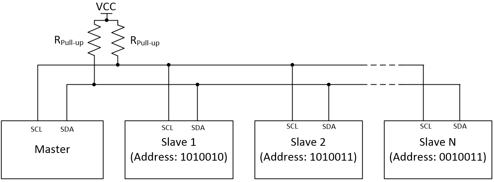
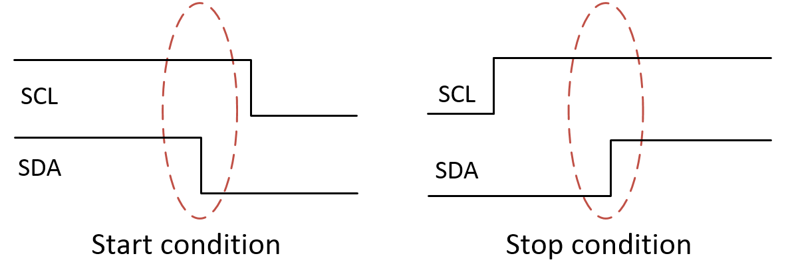
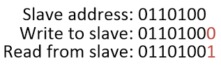
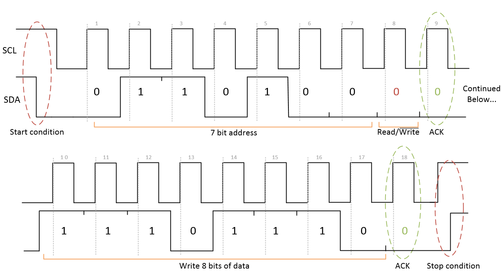
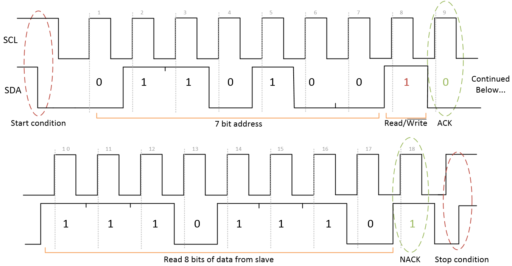
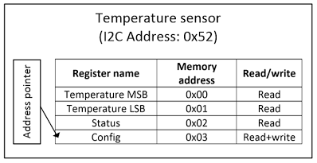
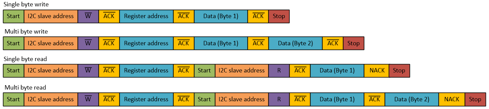
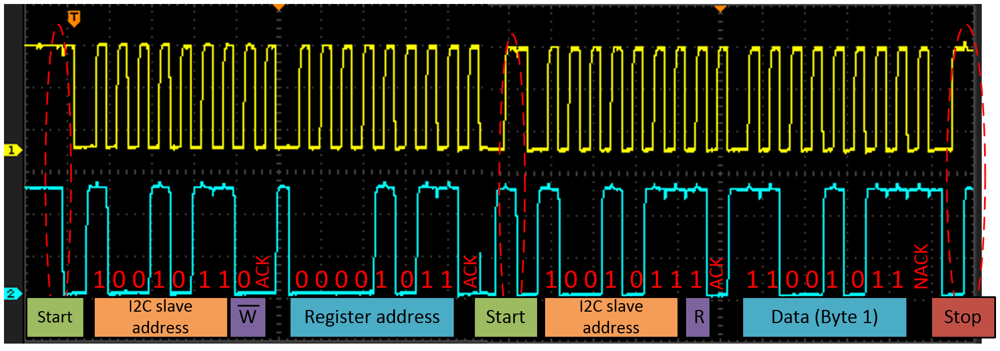

title: Beginners Guide to I2C
date: 2025/06/01
description: I2C is a synchronous, half-duplex, serial, communication protocol commonly used to communicate between several integrated circuits on a PCB. This article provides a basic introduction to the protocol.
main_image: i2c.svg

I2C (or I2C) is a synchronous, half-duplex, serial, communication protocol commonly used to communicate between several integrated circuits on a PCB. I2C is often used to interface between a microcontroller and devices such as temperature sensors, accelerometers, and EEPROMs. 

There are two different types of I2C devices, master devices and slave devices. The master controls the I2C bus and sends commands to slave devices on the bus. Slave devices respond to commands from the master. Both master and slave devices can transmit and receive data, however only the master device can initiate a communication event. In most situations there is a single master on an I2C bus, while there can be many slave devices. It is possible to have multiple master devices on an I2C bus, however this is not that common and is outside the scope of this article. 

## Physical interface
I2C communication uses two wires, SDA (Serial data line) and SCL (Serial clock line). I2C devices connect to the bus in parallel as shown in the diagram below.

{.image_responsive .image_shadow .image_800px .image_centred}

I2C devices use [open drain](http://en.wikipedia.org/wiki/Open_drain#MOSFET){target="_blank"} outputs for both the SDA and SCL lines. This means that each device can either pull the line low, or allow it to float. When in the floating state, pull up resistors are used to pull the voltage of the line up to VCC. The reason for using open drain outputs is that it prevents two devices on the bus from trying to force the line to both VCC and GND at the same time, which would cause a short circuit. 

The value for the pull-up resistors is typically a trade off between the rise time of the signal and the current draw of the bus. A common choice is 4.7 kΩ. If the I2C lines are long or there are many devices on the bus the capacitance of the I2C bus can be high. In order to meet signal rise time requirements the pull up resistance can be reduced (Tau = R*C). As a rule of thumb start around 4.7 kΩ and reduce the resistance gradually if that doesn't work. 

## I2C addressing
Each I2C device has a 7-bit address meaning there are 127 possible addresses (Although some are reserved for special purposes). The address of each device on the bus must be unique. The address of an I2C device is typically set by the manufacturer. Unfortunately there are tens of thousands of different I2C devices available so many devices have conflicting addresses. To get around this some devices allow several of the address bits to be set by connecting pins on the I2C device to VCC (1) or GND (0). The I2C specification also allows for 10-bit addresses, however these are not as common and are outside the scope of this article. If two devices with conflicting non user settable addresses must be used then either two separate I2C buses are required, or each IC must be enabled only when required via a chip select pin (like in SPI communications).

## I2C protocol
When the I2C bus is idle both SDA and SCL are HIGH. When a master device wishes to start a communication event it first pulls SDA LOW and then after pulls SCL LOW. This special sequence is known as a start condition and lets all devices on the bus know that the bus is now in use. The stop condition tells all devices that communication is complete and the bus is now free. The stop condition occurs when the master allows the SDA line to go HIGH when the SCL line is already HIGH. The start and stop conditions are shown in the diagram below. 

{.image_responsive .image_shadow .image_500px .image_centred}

With the exception of the start and stop conditions all other changes of the SDA line occur only when SCL is LOW. Data is clocked into devices on the rising clock edge. The clock (SCL) signal is generated by the master device. Almost all I2C devices support clock speeds up to 100kHz, many support up to 400kHz, and some can go as high as 3.4MHz.

I2C communications transmits data in 8-bit chunks. After the start condition has been set the master device transmits the address of the device it wishes to communicate with. Since the addresses are 7 bits long the address is shifted to the left and the least significant bit it set to either a 0 or 1 depending on if the master device wishes to read (1) or write (0) to the slave device. This is shown in the example below.

{.image_responsive .image_shadow .image_300px .image_centred}

After each byte of data is transmitted, the receiving device acknowledges that it received the data and that the communications should continue. The acknowledge takes place on the 9th rising clock edge. The master allows the SDA line to float HIGH. If the slave has successfully received the data it pulls the line LOW, this is known as an ACK. If the slave is not present or is unable to process the data the line is left HIGH, this is known as a NACK (negative/no acknowledge). 

## Write to slave
The sequence of events required to write a single byte of data to a slave device are shown below:

1. The master sets the start condition. 
2. The master transmits the 7-bit address of the device it wishes to communicate with. A 0 is appended to the address to indicate that the master would like to write to the slave. 
3. The slave acknowledges that it is ready to receive data by pulling the SDA line LOW on the 9th positive clock edge. 
4. The master transmits a single byte of data to the slave. 
5. The slave acknowledges receipt of the data by pulling the SDA line LOW after the data is received. 
6. The master sets the stop condition, indicating the bus is now idle.

The example below shows a master writing a byte of data (11101110) to a slave with address 0110100.

{.image_responsive .image_shadow .image_800px .image_centred}

If multiple bytes of data are to be written to the slave then steps 4 and 5 are repeated until all the desired data is transferred.

## Read from slave
The sequence of events to read data from a slave are shown below. 

1. The master sets the start condition. 
2. The master transmits the 7-bit address of the device it wishes to communicate with. A 1 is appended to the address to indicate that the master would like to read from the slave. 
3. The slave acknowledges that it is ready to transmit data by pulling the SDA line LOW on the 9th positive clock edge. 
4. The slave transmits a single byte of data to the master.
5. If the master would like to read another byte of data it pulls the SDA line LOW on the next positive clock edge (ACK) [Go to step 4]. If the master has received enough data it allows the SDA line to float HIGH (NACK) indicating to the slave that no more data should be sent.
6. The master sets the stop condition, indicating the bus is now idle.

The example below shows a master reading a single byte of data from a slave with address 0110100. The slave replies with data 11101110 and the master replies back with a NACK indicating that it only wants this one byte of data.

{.image_responsive .image_shadow .image_800px .image_centred}

## I2C devices with registers
Unfortunately most I2C devices are a little more complex to communicate with. These devices have several registers which can all be written and/or read from. Each register is assigned a memory address within the device. When communicating with these devices it is necessary to first write the address of the desired register to the I2C device. This sets the address pointer to the location of the desired register. Data can then be read or written to the device as previously explained. In most devices the address pointer automatically increments after each read or write. This means that when accessing sequential registers the address pointer only needs to be set once. Below is an example of a register map for an I2C temperature sensor.

{.image_responsive .image_shadow .image_500px .image_centred}

## Writing to a specific register on a slave
The sequence of events for writing to a specific register within a slave are shown below.

1. The master sets the start condition. 
2. The master transmits the 7-bit address of the device it wishes to communicate with. A 0 is appended to the address to indicate that the master would like to write to the slave. 
3. The slave acknowledges that it is ready to receive data by pulling the SDA line LOW after the data has been received.
4. The master transmits the memory address of the register it would like to write to. 
5. The slave acknowledges receipt of the data.
6. The master transmits a single byte of data to the slave. The slave writes this data to the selected register. 
7. The slave acknowledges receipt of the data.
8. If desired, the master can send another byte of data. This is written the next register on the I2C slave [Go to step 7]. If there is no more data to write [Go to step 9].
9. The master sets the stop condition, indicating the bus is now idle.

## Reading a specific register on a slave
The sequence of events for reading a specific register within a slave are shown below.

1. The master sets the start condition. 
2. The master transmits the 7-bit address of the device it wishes to communicate with. A 0 is appended to the address to indicate that the master would like to write to the slave. 
3. The slave acknowledges that it is ready to receive data by pulling the SDA line LOW after the data has been received.
4. The master transmits the memory address of the register it would like to read from. 
5. The slave acknowledges receipt of the data.
6. The master reissues the start condition (known as a restart condition or repeated start).
7. The master transmits the 7-bit address of the device it wishes to communicate with. A 1 is appended to the address to indicate that the master would like to read from the slave. 
8. The slave acknowledges that it is ready to transmit data by pulling the SDA line LOW after the data has been received.
9. The slave transmits a single byte of data to the master.
10. If the master would like to read another byte of data it pulls the SDA line LOW on the next positive clock edge (ACK) [Go to step 9]. If the master has received enough data it allows the SDA line to float HIGH (NACK) indicating to the slave that no more data should be sent.
11. The master sets the stop condition, indicating the bus is now idle.

The diagram below shows the sequence of events for reading and writing to a typical I2C slave.

{.image_responsive .image_shadow .image_800px .image_centred}

## Real example
Below is an example of a single byte read from an [ADT7410 I2C temperature sensor](http://www.analog.com/static/imported-files/data_sheets/ADT7410.pdf){target="_blank"}.
The I2C address of the device is: 1001011 (0x4B). The address of the register being read is 0x0B which is the ID register for the ADT7410 sensor. The sensor replies with the data 0xCB.

{.image_responsive .image_shadow .image_800px .image_centred}

## Clock stretching
Since the master controls the clock signal, it could attempt to try and read or write data to the slave when the slave is not ready. To overcome this issue the I2C specification includes a technique known as clock stretching. This is where a slave that has been asked to receive or transmit data can hold the clock (SCL) LOW until it is ready to continue. This indicates to the master that the slave is not ready and it will hold off sending the clock pulses until the slave releases SCL.  Please note that not all I2C devices support clock stretching.

## Data ready notification
There are many cases where a slave might need to let a master know that it has data ready to be read. There is no specific method for achieving this however two common methods are:

1. The slave has an additional interrupt pin that is connected to an interrupt pin on the microcontroller. When data is available to be read (e.g. a new ADC conversion) the slave toggles the interrupt line and the master initiates communications via I2C.
2. The slave has a status register that includes a bit which indicates that new data is available to read. The master repeatedly reads the status register via I2C until the bit changes. The master then reads the desired register. 

## General call
The I2C address 0000000 (0x00) is reserved as a general call address. This allows all devices that respond to the general call to be communicated with at the same time. An example use for the general call is to synchronise several ADCs on an I2C bus to take a measurement at the same time. Please see the full [I2C specification](https://www.nxp.com/docs/en/user-guide/UM10204.pdf){target="_blank"} for more information on the general call.

## Recap
- I2C allows communications between ICs within a device or product.
- Master devices are typically microcontrollers and control the clock for the bus.
- Slave devices are typically sensors, ADCs,  or memory. 
- Each slave has an address which must be unique on the bus so that the master can individually address each device.
- Slave devices typically store information in registers which can be individually accessed by the master.
- A start bit is a negative transition of SDA when SCL is HIGH
- A stop bit is a positive transition of SDA when SCL is HIGH
- An ACK is 0 and a NACK is 1
- The direction of data transmission is specified by shifting the 7-bit address to the left and setting the LSB so that: 1 = Read, 0 = Write.