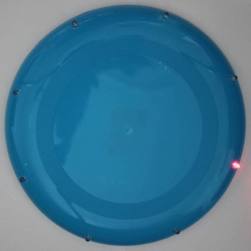
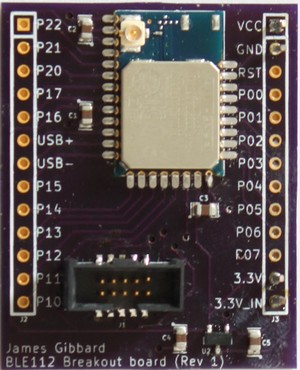
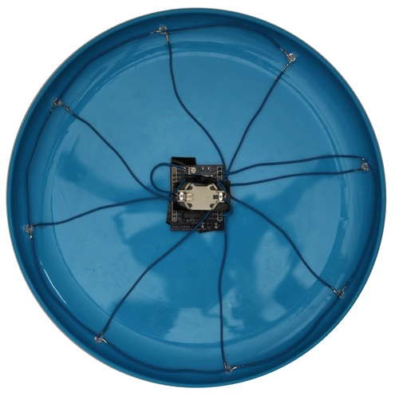
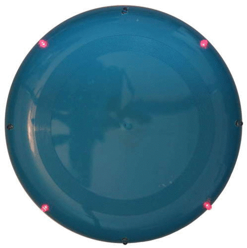
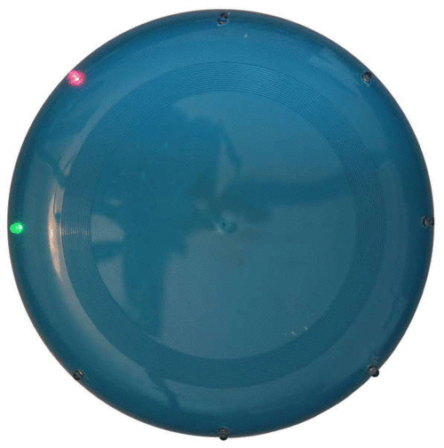
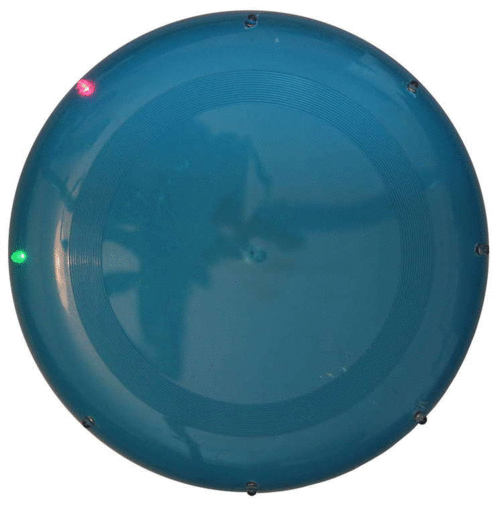

title: Bluetooth controlled LED flashing Frisbee
date: 2014/05/20
description: A few friends and I decided it would be a good idea to make a light-up Frisbee so we could continue playing with it after it became dark. I decided to take it a step further and add control of the lights by via Bluetooth!
main_image: bluetooth.svg

A few friends and I decided it would be a good idea to make a light-up Frisbee so we could continue playing with it after it became dark. The first version featured 8 LEDs located around the edge of the Frisbee. Each LED was connected in parallel via a resistor to a small LiPo battery. This worked well and looked really good in the dark.

{.image_responsive .image_shadow .image_500px .image_centred}

I decided to make a second version using a microcontroller so that the LEDs could be flashed in various patterns. Since I had several BLE112 Bluetooth Low Energy (BLE) modules left over from a previous project, I decided to make a Bluetooth controlled flashing Frisbee! Why…? because “Everything is better with Bluetooth” [(Sheldon Cooper)](https://www.youtube.com/watch?v=H_lf8_pxg2Q){target="_blank}.

The BLE112 modules include a 8051 microcontroller which can be programmed using a propitiatory scripting language called BGScript. BGScript was created by Bluegiga, the manufactures of the BLE112 modules. BGScript works great for simple applications, so it was perfect for this project.

As part of a previous project I had designed a small PCB to breakout the pins on the BLE112 module to through hole 0.1” headers. The PCB was 1.3” x 1.6” and manufactured by [OSH Park](http://oshpark.com/){target="_blank}. In the interest of hacking the Frisbee together quickly I decided to reuse this PCB as well.

{.image_responsive .image_shadow .image_300px .image_centred}

The BLE112 module can be powered by a small 3V lithium coin cell battery. As long as not too many of the LEDs were on at any one time, I decided that a coin cell would be good enough to power the whole Frisbee. Like with the first version I decided to stick to using 8 LEDs. Since the BLE112 has 21 GPIOs I just directly connected each LED to an output on the module. By the time you take in to account the internal resistance of the CR2032 battery I used, it was not necessary to use any resistors between the BLE112 and the LEDs. The PCB was attached in the centre of the Frisbee with the battery mounted on top. This way the majority of the extra weight was located in the centre where it would not affect the Frisbee’s performance too much. Holes for the LEDs were drilled evenly around the Frisbee and the LEDs were mounted using a push fit. I will probably add glue to them for extra stability.

{.image_responsive .image_shadow .image_500px .image_centred}

A simple program was created to control the LEDs. Several flashing sequences were created and tested. The BLE112 module was programmed using a Texas Instruments CC debugger/programmer. The Bluetooth module was configured to provide an 8 bit attribute that was writable by any device connected to it. Changing the attribute value via a phone or tablet would allow changing the flashing pattern and speed. Setting the attribute to a number less than 100 would change the sequence to the one assigned to that number (Only a few sequences were programmed in, but many more could be added. Invalid sequences were just ignored). Setting the attribute to a value between 100 and 255 would set the speed of flashing; higher numbers provide longer delays between each flash. In the interest of speed I didn’t write a smartphone app to control the Frisbee. Instead I used Bluegiga’s example android app to send the 8 bit control values. The code for the BLE112 module can be found on GitHub here. Below are a few more photos of the Frisbee in action!

{.image_responsive .image_shadow .image_300px}
{.image_responsive .image_shadow .image_300px}
{.image_responsive .image_shadow .image_300px}