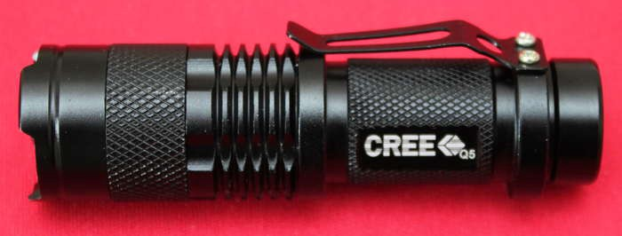
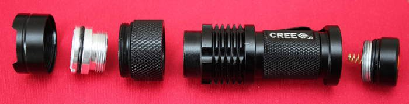
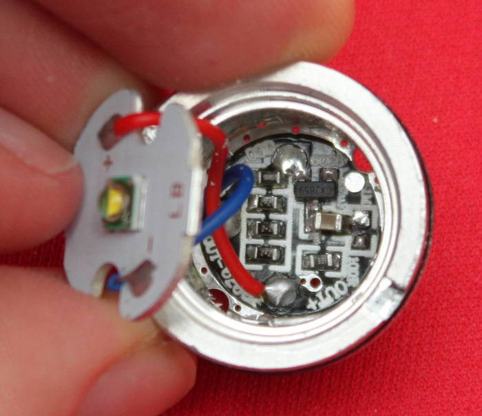
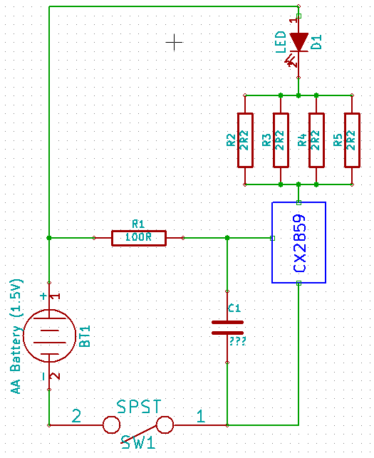

title: Cheap LED Torch Repair
date: 2014/06/02
description: Attempting to fix a broken torch... Yes really!
main_image: light.svg

I recently purchased a torch from [Amazon](http://www.amazon.co.uk/dp/B006E0QAFY){target="_blank"} for a grand total of £2.29 including delivery from China. The torch had very good reviews, one even claiming that the torch would change my life! I was very sceptical about how good the torch would be; with such a low retail price cost the BOM cost would have been pennies.

{.image_responsive .image_shadow .image_500px .image_centred}

After waiting 3 weeks the torch finally arrived. The torch appeared to be mechanically well made, however after inserting the battery it became clear that it did not work. Considering the cost this was hardly surprising. I decided to take the torch apart to see how it worked and what was wrong with it.

The torch came apart very easily; the main mechanical components can be seen below.

{.image_responsive .image_shadow .image_500px .image_centred}

Inside the torch head the electronics for the torch can be seen. Given the price I was expecting a simple series resistor or just I direct connection to the 1.5V AA battery. Instead an IC was used to drive the LED. The markings on the IC indicate it is a CX2859. A quick search shows that this is likely to be a 3 level PWM dimmer IC. Unfortunately I could not find a datasheet or any more information about the chip.

The soldering on the board wasn’t great, but everything seemed to be connected OK.

{.image_responsive .image_shadow .image_500px .image_centred}

Using the continuity tester on a multimeter I identified the torch’s circuit layout. The schematic is shown on the below.

{.image_responsive .image_shadow .image_500px .image_centred}

I removed the LED and connected it to a 3V coin cell battery. The LED worked fine, meaning the issue was with the driver circuitry.

With a battery connected I checked the voltages at various points on the circuit board. Unfortunately everything seemed fine indicating that it was likely to be the driver IC that was faulty.

I noticed on the torch’s Amazon page that it would also work with a 3.7V 14500 lithium ion cell. Since I didn’t have one to hand, I tested it at 3.7V using a bench power supply. Unfortunately that didn’t work either.

I will probably just bodge a constant current driver circuit into the torch as I doubt I will be able to source a replacement CX2859 IC. As always, you get what you pay for!