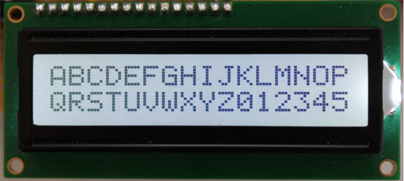
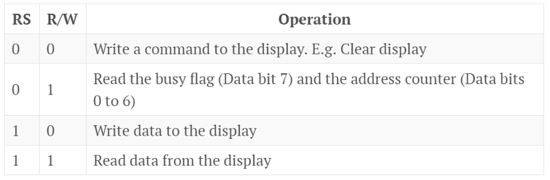
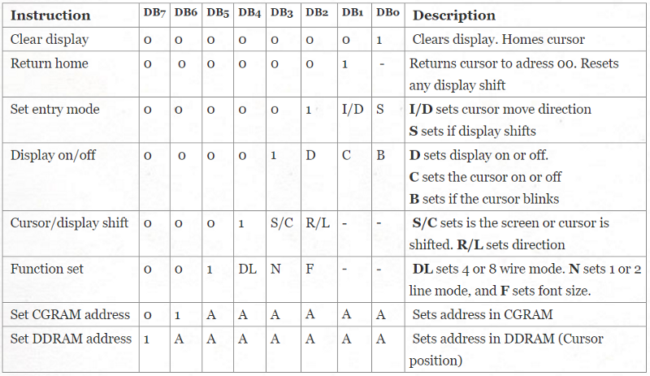
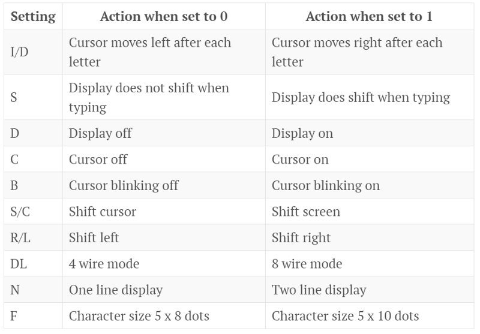
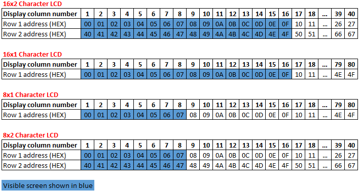
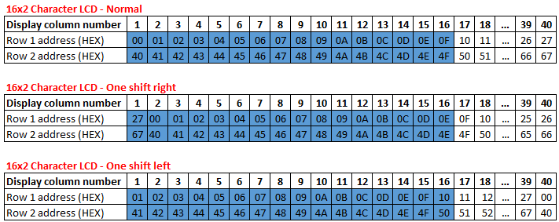
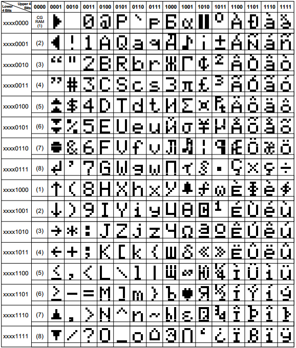
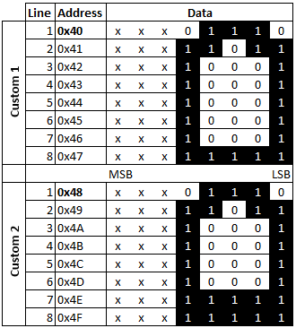
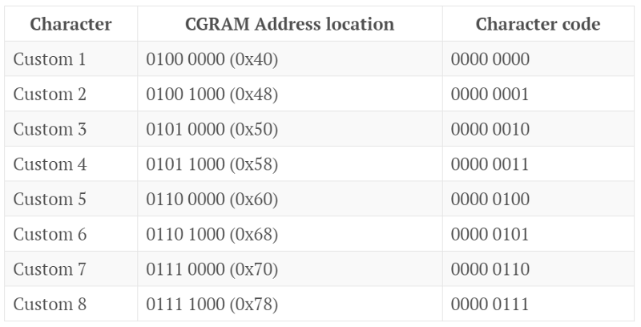

title: Using an HD44780 alphanumeric LCD screen
date: 2013/09/13
description: The Hitachi HD44780 is an LCD screen controller used to control small alphanumeric LCD displays. This post details how to control these displays.
main_image: terminal.svg

# Using an HD44780 alphanumeric LCD screen
The Hitachi HD44780 is an LCD screen controller used to control small alphanumeric LCD displays. Many cheaper displays don’t actually use the HD44780 IC. However, they use the same pin-out and control scheme, and therefore can be operated in the same manner.

{.image_responsive .image_shadow .image_500px}

## Connecting the display
Most screens use the following pin-out, however it is best to refer to the screen’s datasheet if available.

1.  Ground
2.  VCC (Normally 5V)
3.  Contrast adjust input
4.  Register select (Command: RS=0, Data: RS=1)
5.  Read/Write (Read=0, Write=1)
6.  Enable
7.  Data bit 0 (DB0)
8.  Data bit 1 (DB1)
9.  Data bit 2 (DB2)
10. Data bit 3 (DB3)
11. Data bit 4 (DB4)
12. Data bit 5 (DB5)
13. Data bit 6 (DB6)
14. Data bit 7 (DB7)
15. Backlight +
16. Backlight -

The screen has 3 main control lines. RS, R/W, and Enable. The RS and R/W lines determine the operation of the screen, as shown in the table below.

{.image_responsive .image_shadow .image_800px}


The Enable line acts like a clock signal. To clock data in or out of the display the enable line should be set high for 1uS. The enable signal is registered on the falling edge.

The screen has 8 data lines which are used to both read and write data to and from the display. The screen can also operate with 4 data lines, where only DB4, DB5, DB6, and DB7 are used. In this case DB0 to DB3 can be left unconnected. This article will only cover operation of the display using all 8 data lines.

The contrast adjust input should be set to an analogue voltage between VCC and GND. This is normally done with a potentiometer.

## Setting up the display</h3>
Once the display is connected to the microcontroller, it needs to be correctly configured before it can be used. There are several settings that configure how the display operates; these are set by issuing commands to the LCD.

To send a command to the LCD the microcontroller must first check if the screen is busy. If the screen is busy it will ignore any commands sent to it. The pseudo code below shows how to check if the screen is busy.
```
Set data lines as inputs 
Set R/W = 1 
Set RS = 0 
Set enable high 
Wait 1uS 
Set enable low 
Read DB7 
If DB7 is high then LCD busy, else if DB7 is low then LCD ready
```

Once the LCD is ready the microcontroller can send a command to the screen. The pseudo code below shows how this is done.
```
Wait until the screen is not busy 
Set data lines to outputs Set R/W = 0 
Set RS = 0 
Set the 8 data lines to the desired command 
Set enable high 
Wait 1uS 
Set enable low
```
A list of commands can be found in the table below.

{.image_responsive .image_shadow .image_800px}

The dash “-“ means that it doesn’t matter if the data bit is a 1 or 0. A is an address bit. The remaining bit settings are shown in the table below.

{.image_responsive .image_shadow .image_800px}

To initialise the display we need to send several configuration commands as shown in the pseudo code below.
```
Wait until the screen is not busy 
Set data lines to outputs 
Set R/W = 0 
Set RS = 0
Set data lines to: 00111000 
// This sends the "Function set" command. "00111000" configures the display
// to 8 wire mode, and specifies that the screen has 2 lines and 5x8 dots. 
Set enable high 
Wait 1uS 
Set enable low 
Wait until the screen is not busy 
Set data lines to: 00000110 
// This sends the "Set entry mode" command. "00000110" means enable 
// automatic shift of cursor after character, and disable screen shifting 
Set enable high 
Wait 1uS 
Set enable low 
Wait until the screen is not busy 
Set data lines to: 00001100 // Sends "Display on/off" command. Display on,
                            // cursor hidden, don't blink cursor. 
Set enable high 
Wait 1uS 
Set enable low
```

## Controlling the display
Now the screen has been configured, data can be written to the LCD display. By default the cursor starts in the top left hand corner of the screen. The pseudo code below shows how the text “HI” can be written to the screen.
```
Wait until the screen is not busy 
Set data lines to outputs 
Set R/W = 0 
Set R/S = 1 
Set data lines to 01001000 // ASCII code for "H" Set enable high 
Wait 1uS 
Set enable low 
Set data lines to 01001001 // ASCII code for "I" 
Set enable high 
Wait 1uS 
Set enable low
```

When “H” is entered the cursor automatically moves one character to the right. This means that when “I” is entered it appears to the right of “H”.

If you were to keep entering more characters the cursor would eventually disappear off the edge of the screen. Characters will still be written to the LCD, but they will not be visible. This is because while the screen may only have space for 16 (or 8) characters on each line, the controller actually has space to store 80 characters in its memory.

A map of the display’s memory (DDRAM) is shown below for the 4 most common LCD sizes.

{.image_responsive .image_shadow .image_800px}

To set the position of the cursor use the “Set DDRAM address” command from the command table further up the page. The pseudo code below shows how the cursor position can be set.
```
Wait until the screen is not busy
Set R/W = 0 Set RS = 0 
Set data lines to: 10000000 // Set DDRAM address. Cursor to Row 1, col 1 
Set enable high 
Wait 1uS 
Set enable low 
Wait until the screen is not busy 
Set R/W = 0 Set R/S = 1 
Set data lines to 01001000 // ASCII code for "H" Set enable high 
Wait 1uS Set enable low 
Wait until the screen is not busy 
Set data lines to outputs 
Set R/W = 0 
Set RS = 0 
Set data lines to: 11000000 // Set DDRAM address. Cursor to Row 2, col 1
Set enable high 
Wait 1uS 
Set enable low 
Wait until the screen is not busy 
Set R/W = 0 
Set R/S = 1
Set data lines to 01001001 // ASCII code for "I" 
Set enable high 
Wait 1uS 
Set enable low
```
This will print “H” on row 1 and a “I” underneath it.

Using the “Cursor/Display shift” command (see table further up the page) the cursor or screen can be moved left or right by one position. If the display is shifted the DDRAM addresses that are visible will change. This is shown in the image below.

{.image_responsive .image_shadow .image_800px}

The shift of the display can be reset by sending the “Return home” command (see command table further up the page).

## Displaying symbols and other characters
The display supports the standard ASCII codes for the numbers 0–9, letters a-z and A-Z, as well as most standard ASCII symbols such as !?(),. In addition to these, there are many extra symbols. The characters are stored in the CGROM (Character generator rom). The contents of the CGROM can vary depending on who manufactured the display, but most manufactures either use the European or Asian character set produced by Hitachi. These can be found on pages 17 and 18 of the [HD44780 datasheet](https://www.sparkfun.com/datasheets/LCD/HD44780.pdf){target="_blank"}.

The European character set is shown below. Using the table the character code for any character in the set can be identified.

{.image_responsive .image_shadow .image_800px}

Symbols are sent to the screen in the same way as normal characters, as shown below.
```
Wait until the screen is not busy 
Set data lines to outputs 
Set R/W = 0 
Set R/S = 1 
Set data lines to 10011000 //Code for a bell symbol 
Set enable high 
Wait 1uS 
Set enable low
```
If the symbols do not match either the European or Asian character sets then the display is using a custom character set. In this case refer to the datasheet of the LCD display.

## Generating custom LCD characters
Sometimes it is necessary to display characters that are not part of the default character set. The HD44780 has space for 8 custom characters (5x8 dots) which can be displayed on the screen. (For 5x10 dot displays please refer to page 19 of the [HD44780 datasheet](https://www.sparkfun.com/datasheets/LCD/HD44780.pdf){target="_blank"}).

Each character requires 8 bytes of data, one for each of the 8 lines. The 3 MSBs of each byte are ignored, with the remaining 5 bits setting whether the dots appears on or off in the symbol, this is shown in the image below.

{.image_responsive .image_shadow .image_500px}

The CGRAM address of the first line of each of custom characters is shown in the table below. The character code is also shown. This is the code used to display the symbol when it has already been stored in the CGRAM.

{.image_responsive .image_shadow .image_800px}

The pseudo code below shows how a custom symbol can be stored and then displayed on the LCD screen.
```
Wait until the screen is not busy 
// NB. this has been omitted from the rest of this code for clarity,
// but must be done before every command
Set data lines to outputs 
Set R/W = 0 
Set RS = 0 
Set data lines to: 01000000 // Set the CGRAM address to line 1 of 
// custom character 1 
Pulse enable 
Set R/W = 0 
Set RS = 1 
Set data lines to: 000 01110 // Write line 1 of the character 
Pulse enable
Set data lines to: 000 11011 // Write line 2 of the character 
Pulse enable
Set data lines to: 000 10001 // Write line 3 of the character 
Pulse enable
Set data lines to: 000 10001 // Write line 4 of the character 
Pulse enable
Set data lines to: 000 10001 // Write line 5 of the character 
Pulse enable 
Set data lines to: 000 10001 // Write line 6 of the character 
Pulse enable 
Set data lines to: 000 10001 // Write line 7 of the character 
Pulse enable 
Set data lines to: 000 11111 // Write line 8 of the character 
Pulse enable 
Set R/W = 0 
Set RS = 0 
Set data lines to: 1000 0000 // Set the DDRAM address to row 1, column 1
Pulse enable 
Set R/W = 0 
Set RS = 1 
Set data lines to: 0000 0000 // Print custom character 1 
Pulse enable
```
An excellent web interface for designing custom characters can be found at [quinapalus.com](http://www.quinapalus.com/hd44780udg.html){target="_blank"}.

## Interfacing an HD44780 LCD display with a PIC microcontroller
If you wish to use the HD44780 display with a PIC 16 microcontroller I have written a library that implements most of the functions of the display. [The code can be found here.](https://gist.github.com/jgibbard/6475089){target="_blank"}

### TODO
- Add option to select between different screen sizes. I.e 16x4, 16x2, 16x1, 8x4, 8x2, 16x1. Currently only 16x2 is supported.
- Add option to select between 8x5 dot and 10x5 dot displays.
- Modify code so that it is easier to use the code with any PIC microcontroller.
- Add option to select 4 wire mode.