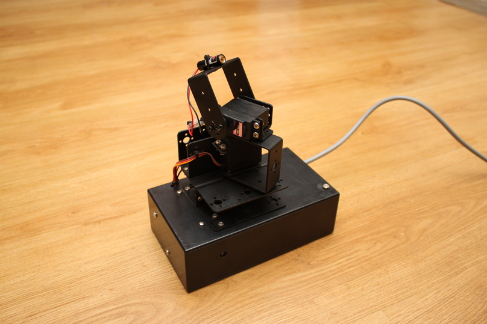

title: LaserCat 9000
date: 2024/04/08
description: Want to play with your cat while at work? Well the LaserCat 9000 is for you! Well... probably not, but think of all the other uses around the house for a remote controlled laser!
main_image: laser.svg

# Overview
Do you ever have a crazy project idea in the middle of the night? Well that is where the idea for making a remote controlled laser cat toy came from..! I built this in a day in the middle of the COVID lockdowns in 2020. 4 years later and I was about to scavenge it for parts, but thought I might as well document it beforehand. If you want to see what a sugar fueled afternoon of python, solder, and javascript gets you, then read on!

{.image_responsive .image_shadow .image_800px .image_centred}

# How it works
The hardware is very simple: a mains power supply provides 5V which powers two servos, a Raspberry Pi Zero W, a Pi ZeroCam, and a laser. The servos are connected directly to the two hardware PWM pins on the Pi Zero and laser is connected to a GPIO on the Pi via a MOSFET. The mechanical parts were salvaged from a cheap robotic arm [like this one](https://www.amazon.co.uk/Robot-Mechanical-Manipulator-Industrial-Motors/dp/B08S6LHCMW/){target="_blank"} (but I only paid about £10 on aliexpress)! 

On the software side of things a python backend streams the video footage, hosts the frontend's static elements, and provides a simple API to allow the front end to send servo position updates to the backend. At the frontend the video feed is displayed (via motion JPEG) and an HTML canvas is used to render a touchpad. On a touchscreen device the user simply moves their finger around the touchpad and the laser will follow their movements. Source code is available at the bottom of this article.

The python backend is set to run on boot-up and with the magic of mDNS you can just go to `lasercat9000.local` to access the frontend. To connect to the system from an external network I just used SSH port forwarding.

# The Result
Here's what the webpage looks like:
{.image_responsive .image_shadow .image_500px .image_centred}

And here is what the system looks like in action. Much more suitable for scaring cats than playing with them!
<iframe class="image_centred" width="560" height="315" src="https://www.youtube.com/embed/EBZf-tjZ9jQ?si=hqJO46P3x-xupS5N" title="YouTube video player" frameborder="0" allow="accelerometer; autoplay; clipboard-write; encrypted-media; gyroscope; picture-in-picture; web-share" referrerpolicy="strict-origin-when-cross-origin" allowfullscreen></iframe>

# Source Code
## Backend
### Python
Hopefully it goes without saying, but don't expose this server to the internet, it is comically insecure.
```python
import io
import picamera
import logging
import socketserver
from threading import Condition
from http import server
from os import curdir, sep
from urllib.parse import urlparse, parse_qs
from rpi_hardware_pwm import HardwarePWM
import RPi.GPIO as GPIO


connected_clients = 0
pwm0 = HardwarePWM(pwm_channel=0, hz=50)
pwm1 = HardwarePWM(pwm_channel=1, hz=50)

def is_float(element):
    try:
        float(element)
        return True
    except ValueError:
        return False


class StreamingOutput(object):
    def __init__(self):
        self.frame = None
        self.buffer = io.BytesIO()
        self.condition = Condition()

    def write(self, buf):
        if buf.startswith(b'\xff\xd8'):
            # New frame, copy the existing buffer's content and notify all
            # clients it's available
            self.buffer.truncate()
            with self.condition:
                self.frame = self.buffer.getvalue()
                self.condition.notify_all()
            self.buffer.seek(0)
        return self.buffer.write(buf)

class StreamingHandler(server.BaseHTTPRequestHandler):
    def do_GET(self):
        global connected_clients
        global pwm0
        global pwm1

        if self.path.startswith("/api"):
            value = parse_qs(urlparse(self.path).query)

            if "x" not in value or "y" not in value:
                self.send_response(400)
                self.send_header('Content-Type', 'application/json')
                self.end_headers()
                json_str = '{"success":false}'
                self.wfile.write(json_str.encode(encoding='utf_8'))
                return
            
            if type(value["x"]) is not list or type(value["y"]) is not list:
                self.send_response(400)
                self.send_header('Content-Type', 'application/json')
                self.end_headers()
                json_str = '{"success":false}'
                self.wfile.write(json_str.encode(encoding='utf_8'))
                return

            x = value["x"][0]
            y = value["y"][0]

            if not is_float(x) or not is_float(y):
                self.send_response(400)
                self.send_header('Content-Type', 'application/json')
                self.end_headers()
                json_str = '{"success":false}'
                self.wfile.write(json_str.encode(encoding='utf_8'))
                return

            x_val = float(x)
            y_val = float(y)
            
            if x_val < 1000.0 or x_val > 2200.0:
                self.send_response(400)
                self.send_header('Content-Type', 'application/json')
                self.end_headers()
                json_str = '{"success":false}'
                self.wfile.write(json_str.encode(encoding='utf_8'))
                return

            if y_val < 1000.0 or y_val > 2400.0:
                self.send_response(400)
                self.send_header('Content-Type', 'application/json')
                self.end_headers()
                json_str = '{"success":false}'
                self.wfile.write(json_str.encode(encoding='utf_8'))
                return

            pwm0.change_duty_cycle((y_val / 20000.0) * 100.0)
            pwm1.change_duty_cycle((x_val / 20000.0) * 100.0)
            self.send_response(200)
            self.send_header('Content-Type', 'application/json')
            self.end_headers()
            json_str = '{"success":true}'
            self.wfile.write(json_str.encode(encoding='utf_8'))

        elif self.path == '/':
            self.send_response(301)
            self.send_header('Location', '/index.html')
            self.end_headers()
        elif self.path in ["/index.html", "/main.js"]:
            f = open(curdir + sep + "www" + sep + self.path, "rb")
            self.send_response(200)
            if self.path.endswith(".html"):
                self.send_header('Content-type', 'text/html')
            elif self.path.endswith(".js"):
                self.send_header('Content-type', 'text/javascript')
            elif self.path.endswith(".css"):
                self.send_header('Content-type', 'text/css')
            self.end_headers()
            self.wfile.write(f.read())
            f.close()
        elif self.path == '/stream.mjpg':
            self.send_response(200)
            self.send_header('Age', 0)
            self.send_header('Cache-Control', 'no-cache, private')
            self.send_header('Pragma', 'no-cache')
            self.send_header('Content-Type', 'multipart/x-mixed-replace; boundary=FRAME')
            self.end_headers()
            try:
                connected_clients += 1
                GPIO.output(6, 1)
                while True:
                    with output.condition:
                        output.condition.wait()
                        frame = output.frame
                    self.wfile.write(b'--FRAME\r\n')
                    self.send_header('Content-Type', 'image/jpeg')
                    self.send_header('Content-Length', len(frame))
                    self.end_headers()
                    self.wfile.write(frame)
                    self.wfile.write(b'\r\n')
            except Exception as e:
                connected_clients -= 1
                if connected_clients == 0:
                    GPIO.output(6, 0)
        else:
            self.send_error(404)
            self.end_headers()
    def log_message(self, format, *args):
            pass
class StreamingServer(socketserver.ThreadingMixIn, server.HTTPServer):
    allow_reuse_address = True
    daemon_threads = True


def angleToPer(angle):
    upper = 2400
    lower = 600
    pulse_width = ((angle / 180) * (upper-lower)) + lower
    percent = (pulse_width / 20000) * 100
    return percent

GPIO.setwarnings(False)
GPIO.setmode(GPIO.BCM)
GPIO.setup(6, GPIO.OUT)
GPIO.output(6, 0)
pwm0.start((1700 / 20000) * 100)
pwm1.start((1600 / 20000) * 100)

with picamera.PiCamera(resolution='640x480', framerate=24) as camera:
    output = StreamingOutput()
    camera.start_recording(output, format='mjpeg')
    try:
        address = ('', 80)
        server = StreamingServer(address, StreamingHandler)
        server.serve_forever()
    finally:
        camera.stop_recording()
        pwm0.stop()
        pwm1.stop()
        GPIO.cleanup()
```

## Frontend
### HTML
```html
<!DOCTYPE html>
<html>
    <head>
        <title>Laser Cat 9000</title>
        <meta name="viewport" content="width=device-width, initial-scale=1.0">
        <script src="https://code.jquery.com/jquery-3.6.0.min.js" 
                integrity="sha256-/xUj+3OJU5yExlq6GSYGSHk7tPXikynS7ogEvDej/m4=" 
                crossorigin="anonymous">
        </script>
        
        <script src="main.js"></script>
        <link rel="stylesheet" href="https://unpkg.com/@picocss/pico@latest/css/pico.min.css">
        <style>
            .stream {
                width: 100%;
                max-width: 640px;
                height: auto
                }
        </style>
    </head>
    <body>
        <script>0</script>
        <main class="container">
            <h1>Laser Cat 9000</h1>
                <div class="grid">
                    <div>
                        
                    </div>
                    <div id="canvas_div">
                        <canvas id="sketchpad" width="640" height="480" style="border:1px solid #000000;"></canvas>
                    </div>
                </div>
            
        </main>
        
    </body>
</html>
```
### Javascript

```javascript
$( document ).ready(function() {
    console.log( "ready!" );

    // Get the specific canvas element from the HTML document
    canvas = document.getElementById('sketchpad');

    // If the browser supports the canvas tag, get the 2d drawing context for this canvas
    if (canvas.getContext)
        ctx = canvas.getContext('2d');

    // Check that we have a valid context to draw on/with before adding event handlers
    if (ctx) {
        parent = document.getElementById('canvas_div');
        canvas.width = parent.clientWidth;
        canvas.height = canvas.width * 0.75;

        // React to mouse events on the canvas, and mouseup on the entire document
        canvas.addEventListener('mousedown', sketchpad_mouseDown, false);
        canvas.addEventListener('mousemove', sketchpad_mouseMove, false);
        window.addEventListener('mouseup', sketchpad_mouseUp, false);

        // React to touch events on the canvas
        canvas.addEventListener('touchstart', sketchpad_touchStart, false);
        canvas.addEventListener('touchmove', sketchpad_touchMove, false);

        window.onresize = updateCanvas;
        updateCanvas();
    }
});

function updateCanvas() {
    parent = document.getElementById('canvas_div');
    canvas.width = parent.clientWidth;
    canvas.height = canvas.width * 0.75;
    ctx.strokeStyle = "rgba(255,0,0,255)";
    ctx.fillStyle = "rgba(255,0,0,255)";

    ctx.beginPath();
    ctx.setLineDash([5, 5]);
    ctx.moveTo(canvas.width/2, 0);
    ctx.lineTo(canvas.width/2, canvas.height);
    ctx.stroke();

    ctx.beginPath();
    ctx.setLineDash([5, 5]);
    ctx.moveTo(0,canvas.height/2);
    ctx.lineTo(canvas.width, canvas.height/2);
    ctx.stroke();
    
    ctx.beginPath();
    ctx.arc(canvas.width/2, canvas.height/2, 3, 0, Math.PI*2, true); 
    ctx.closePath();
    ctx.fill();

}

function sendPosition(x,y){

    $.get({
        method: 'GET',
        url: 'api',
        headers: {
            'Content-Type': 'application/json',
        },
        data: {
            x: x,
            y: y
        }
    });
}

let last_time = 0

// Variables for referencing the canvas and 2dcanvas context
var canvas,ctx;

// Variables to keep track of the mouse position and left-button status 
var mouseX,mouseY,mouseDown=0;

// Variables to keep track of the touch position
var touchX,touchY;

function translateX(value) {
    const servo_min = 1000;
    const servo_max = 2200;
    if (value < 0) value = 0;
    if (value > canvas.width) value = canvas.width;
    // Invert axis
    value = canvas.width - value
    const canvasSpan = canvas.width;
    const servoSpan = servo_max - servo_min;
    let valueScaled = value / canvasSpan;
    let pulse_width =  servo_min + (valueScaled * servoSpan);
    return pulse_width;
}


function translateY(value) {
    const servo_min = 1000;
    const servo_max = 2400;
    if (value < 0) value = 0;
    if (value > canvas.height) value = canvas.height;
    // Invert axis
    value = canvas.height - value
    const canvasSpan = canvas.height;
    const servoSpan = servo_max - servo_min;
    let valueScaled = value / canvasSpan;
    let pulse_width =  servo_min + (valueScaled * servoSpan);
    return pulse_width;
}

// Draws a dot at a specific position on the supplied canvas name
// Parameters are: A canvas context, the x position, the y position, the size of the dot
function drawDot(ctx,x,y,size) {
    
    const d = new Date();
    const current_time = d.getTime();
    if ((current_time - 100) > last_time) {
        sendPosition(translateX(x),translateY(y));
        //console.log(xabs,yabs);
        last_time = current_time;
    }
  
    // Select a fill style
    ctx.fillStyle = "rgba(0,0,0,255)";

    // Draw a filled circle
    ctx.beginPath();
    ctx.arc(x, y, size, 0, Math.PI*2, true); 
    ctx.closePath();
    ctx.fill();
} 

// Clear the canvas context using the canvas width and height
function clearCanvas(canvas,ctx) {
    ctx.clearRect(0, 0, canvas.width, canvas.height);
}

// Keep track of the mouse button being pressed and draw a dot at current location
function sketchpad_mouseDown() {
    mouseDown=1;
    drawDot(ctx,mouseX,mouseY,2);
}

// Keep track of the mouse button being released
function sketchpad_mouseUp() {
    mouseDown=0;
}

// Keep track of the mouse position and draw a dot if mouse button is currently pressed
function sketchpad_mouseMove(e) { 
    // Update the mouse co-ordinates when moved
    getMousePos(e);

    // Draw a dot if the mouse button is currently being pressed
    if (mouseDown==1) {
        drawDot(ctx,mouseX,mouseY,2);
    }
}

// Get the current mouse position relative to the top-left of the canvas
function getMousePos(e) {
    if (!e)
        var e = event;

    if (e.offsetX) {
        mouseX = e.offsetX;
        mouseY = e.offsetY;
    }
    else if (e.layerX) {
        mouseX = e.layerX;
        mouseY = e.layerY;
    }
    }

// Draw something when a touch start is detected
function sketchpad_touchStart() {
    // Update the touch co-ordinates
    getTouchPos();

    drawDot(ctx,touchX,touchY,2);

    // Prevents an additional mousedown event being triggered
    event.preventDefault();
}

// Draw something and prevent the default scrolling when touch movement is detected
function sketchpad_touchMove(e) { 
    // Update the touch co-ordinates
    getTouchPos(e);

    // During a touchmove event, unlike a mousemove event, we don't need to check if the
    // touch is engaged, since there will always be contact with the screen by definition.
    drawDot(ctx,touchX,touchY,2); 

    // Prevent a scrolling action as a result of this touchmove triggering.
    event.preventDefault();
}

// Get the touch position relative to the top-left of the canvas
// When we get the raw values of pageX and pageY below, they take into account the scrolling on the page
// but not the position relative to our target div. We'll adjust them using "target.offsetLeft" and
// "target.offsetTop" to get the correct values in relation to the top left of the canvas.
function getTouchPos(e) {
    if (!e)
        var e = event;

    if(e.touches) {
        if (e.touches.length == 1) { // Only deal with one finger
            var touch = e.touches[0]; // Get the information for finger #1
            touchX=touch.pageX-touch.target.offsetLeft;
            touchY=touch.pageY-touch.target.offsetTop;
        }
    }
}
```
