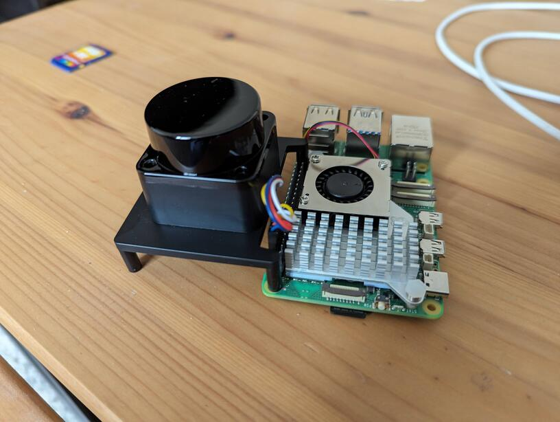

title: LD06 LIDAR Module
date: 2024/05/11
description: Extracting position data from a low cost LD06 LIDAR module.
main_image: lidar.svg

# Overview
A friend forwarded me a [tweet](https://twitter.com/tomfleet/status/1783253096430268868) showcasing someone experimenting with a £10 LIDAR module. Without any concrete plans, I promptly purchased two from [here](https://www.ebay.co.uk/itm/395159855374). The price has now gone up slightly, but they are still well worth the money in my opinion. 

The Ebay listing describes it as an [Okdo Lidar Hat](https://www.okdo.com/getting-started/get-started-with-lidar-hat-for-raspberry-pi/), which appears to be a repackaging of a *LD06 Super Mini DTOF Principal Lidar* module with a bracket to fit it on top of a Raspberry Pi. 

{.image_responsive .image_shadow .image_800px .image_centred}

The *Pi Hat* doesn't quite clear the stock cooler on the Pi 5, but it can still be attached off to the side. The actual LIDAR module is separate to the Pi mounting bracket, so there is no requirement to use it.

# How it works
There are few sources of information on the module:

 - Product page for the [Okdo Lidar Hat](https://www.okdo.com/getting-started/get-started-with-lidar-hat-for-raspberry-pi/). This has the LIDAR pin out and some setup instructions if using Robot Operating System.

 - Product page for [LiDAR LD06](https://www.inno-maker.com/product/lidar-ld06/). Complete with [datasheet](datasheet.pdf). Note the much higher unit cost!

 - [Github page for the LD06](https://github.com/LetsOKdo/sdk_ld06_raspberry_ros/tree/main).

 - [Github page for the LD19](https://github.com/LetsOKdo/ld19/tree/master). Containing a [pdf datasheet](https://github.com/LetsOKdo/ld19/blob/master/datasheet/LDROBOT_LD19_Datasheet_V1.0.pdf).

Note that the LD19 seems to be functionally identical to the LD06.

The datasheet shows that interfacing with the module is very simple. Data is constantly streamed over a 3.3V UART at 230400 baud. The UART connection is unidirectional from the LIDAR to the microcontroller / PC. The only configuration possible is the LIDAR's rotation speed. This is set via a 5V PWM pin, where the duty cycle sets the LIDAR scan rate. If the PWM pin is not driven, the LIDAR defaults to 10 rotations per second. According to the datasheet 10 Hz is equivalent to a PWM duty cycle of 40% - Given the minimum rotation speed is 5 Hz and the maximum is 13 Hz, it is safe to assume there is not a linear scale between PWM and rotation speed.

Unfortunately the datasheet doesn't actually describe the protocol sent over serial, but there is some source code on the github pages that makes it easy enough to determine (I typically only spotted this code once I had already pretty much reverse engineered the whole protocol!). Each packet consists of a fixed header byte, a length field (presumed fixed), a start angle, 12 distance measurements, a stop angle, a timestamp, and a CRC field. The distance measurements can be assumed to be evenly spaced between the start and stop angle. I've put a block comment in the code at the end of this page with the full protocol description. As an aside, I brute forced the CRC polynomial using [this tool](https://github.com/nitram2342/bruteforce-crc).

# Getting it running
I opted against using the software provided on the product page and instead developed my own protocol parser for the LIDAR in Python. Additionally, I created a basic method for visualizing live LIDAR data using matplotlib. You can find the complete source code at the bottom of this page. Below, you can observe the LIDAR in action as it is moved through various rooms within a building.

<iframe class="image_centred" width="560" height="315" src="https://www.youtube.com/embed/mDak6c9r-Ds?si=XpzYanjjo-Z3AHnt" title="YouTube video player" frameborder="0" allow="accelerometer; autoplay; clipboard-write; encrypted-media; gyroscope; picture-in-picture; web-share" referrerpolicy="strict-origin-when-cross-origin" allowfullscreen></iframe>

# What next
I'm highly impressed at how well this LIDAR module works, and given how easy it is to interface with, and how clean the data is without any additional filtering, it would be totally possible to use this module with a microcontroller rather than PC / single board PC. A little widget for instantly capturing a floor plan would be a cool "low processing required" application. Alternately, I've never actually implemented any [SLAM](https://en.wikipedia.org/wiki/Simultaneous_localization_and_mapping) algorithms, so learning the basics of that area would be a fun project.

# Source Code
The following source code is designed to run on any PC equipped with Python 3.6 or higher, along with the necessary packages: numpy, matplotlib, and pyserial. While the script offers several configuration options at the top, you'll likely only need to adjust the `SERIAL_PORT` setting. Although only tested on Linux, it should function smoothly on Windows and Mac systems as well.

```python
#!/usr/bin/env python3

import numpy as np
import matplotlib.pyplot as plt
import serial
from enum import Enum
import struct

# ----------------------------------------------------------------------
# System Constants
# ----------------------------------------------------------------------
# Serial port of the LIDAR unit
SERIAL_PORT = "/dev/ttyAMA0"
# At the default rotation speed (~3600 deg/s) the system outputs about 
# 480 measurements in a full rotation. We want to plot at least this
# many in order to get a 360 degree plot
MEASUREMENTS_PER_PLOT = 480
# System will plot between +/-PLOT_MAX_RANGE on both X and Y axis
PLOT_MAX_RANGE = 4.0 # in meters
# Set the plot area to autoscale to the max distance in X or Y
PLOT_AUTO_RANGE = False
# Show the confidence as a colour gradiant on the plot
PLOT_CONFIDENCE = True
# Set the colour gradiant to use. See this URL for options:
# https://matplotlib.org/stable/gallery/color/colormap_reference.html
PLOT_CONFIDENCE_COLOUR_MAP = "bwr_r"
# Enable debug messages
PRINT_DEBUG = False
# ----------------------------------------------------------------------
# Main Packet Format
# ----------------------------------------------------------------------
# All fields are little endian
# Header (1 byte) = 0x54
# Length (1 byte) = 0x2C (assumed to be constant)
# Speed (2 bytes) Rotation speed in degrees per second
# Start angle (2 bytes) divide by 100.0 to get angle in degrees
# Data Measurements (MEASUREMENT_LENGTH * 3 bytes)
#                   See "Format of each data measurement" below
# Stop angle (2 bytes) divide by 100.0 to get angle in degrees
# Timestamp (2 bytes) In milliseconds
# CRC (1 bytes) Poly: 0x4D, Initial Value: 0x00, Final Xor Value: 0x00
#               Input reflected: False, Result Reflected: False
#               http://www.sunshine2k.de/coding/javascript/crc/crc_js.html
# Format of each data measurement
# Distance (2 bytes) # In millimeters
# Confidence (1 byte)

# ----------------------------------------------------------------------
# Packet format constants
# ----------------------------------------------------------------------
# These do not vary
PACKET_LENGTH = 47
MEASUREMENT_LENGTH = 12 
MESSAGE_FORMAT = "<xBHH" + "HB" * MEASUREMENT_LENGTH + "HHB"

State = Enum("State", ["SYNC0", "SYNC1", "SYNC2", "LOCKED", "UPDATE_PLOT"])

def parse_lidar_data(data):
	# Extract data
	length, speed, start_angle, *pos_data, stop_angle, timestamp, crc = \
		struct.unpack(MESSAGE_FORMAT, data)
	# Scale values
	start_angle = float(start_angle) / 100.0
	stop_angle = float(stop_angle) / 100.0
	# Unwrap angle if needed and calculate angle step size
	if stop_angle < start_angle:
		stop_angle += 360.0
	step_size = (stop_angle - start_angle) / (MEASUREMENT_LENGTH - 1)
	# Get the angle for each measurement in packet
	angle = [start_angle + step_size * i for i in range(0,MEASUREMENT_LENGTH)]
	distance = pos_data[0::2] # in millimeters
	confidence = pos_data[1::2]
	if PRINT_DEBUG:
		print(length, speed, start_angle, *pos_data, stop_angle, timestamp, crc)
	return list(zip(angle, distance, confidence))

def get_xyc_data(measurements):
	# Unpack the tuples
	angle = np.array([measurement[0] for measurement in measurements])
	distance = np.array([measurement[1] for measurement in measurements])
	confidence = np.array([measurement[2] for measurement in measurements])
	# Convert to cartesian coordinates in meters
	x = np.sin(np.radians(angle)) * (distance / 1000.0)
	y = np.cos(np.radians(angle)) * (distance / 1000.0)
	return x, y, confidence

running = True

def on_plot_close(event):
	global running
	running = False

if __name__ == "__main__":
	# Connect up to the LIDAR serial port
	lidar_serial = serial.Serial(SERIAL_PORT,  230400, timeout=0.5)

	# Set up initial state
	measurements = []
	data = b''
	state = State.SYNC0

	# Set up matplotlib plot
	plt.ion()
	# Force a square aspect ratio
	plt.rcParams['figure.figsize'] = [10, 10]
	plt.rcParams['lines.markersize'] = 2.0
	if PLOT_CONFIDENCE:
		graph = plt.scatter([], [], c=[], marker=".", vmin=0,
						    vmax=255, cmap=PLOT_CONFIDENCE_COLOUR_MAP)
	else:
		graph = plt.plot([], [], ".")[0]
	# Set up the program to shutdown when the plot is closed
	graph.figure.canvas.mpl_connect('close_event', on_plot_close)
	# Limit to +/- PLOT_MAX_RANGE meters
	plt.xlim(-PLOT_MAX_RANGE,PLOT_MAX_RANGE)
	plt.ylim(-PLOT_MAX_RANGE,PLOT_MAX_RANGE)
	
	# Main state machine
	while running:
		# Find 1st header byte
		if state == State.SYNC0:
			data = b''
			measurements = []
			if lidar_serial.read() == b'\x54':
				data = b'\x54'
				state = State.SYNC1
		# Find 2nd header byte
		# Technically this is the length field but the packet length
		# is fixed, so it can be treated as a constant.
		elif state == State.SYNC1:
			if lidar_serial.read() == b'\x2C':
				state = State.SYNC2
				data += b'\x2C'
			else:
				state = State.SYNC0
		# Read remainder of the packet (PACKET_LENGTH minus the 2 header
		# bytes we have already read).
		elif state == State.SYNC2:
			data += lidar_serial.read(PACKET_LENGTH - 2)
			if len(data) != PACKET_LENGTH:
				state = State.SYNC0
				continue
			measurements += parse_lidar_data(data)
			state = State.LOCKED
		elif state == State.LOCKED:
			data = lidar_serial.read(PACKET_LENGTH)
			if data[0] != 0x54 or len(data) != PACKET_LENGTH:
				print("WARNING: Serial sync lost")
				state = State.SYNC0
				continue
			measurements += parse_lidar_data(data)
			if len(measurements) > MEASUREMENTS_PER_PLOT:
				state = State.UPDATE_PLOT
		elif state == State.UPDATE_PLOT:
			x, y, c = get_xyc_data(measurements)
			# Work out max coordinate, and set the scale based on this.
			# Force a 1:1 aspect ratio
			if PLOT_AUTO_RANGE:
				mav_val = max([max(abs(x)), max(abs(y))]) * 1.2
				plt.xlim(-mav_val,mav_val)
				plt.ylim(-mav_val,mav_val)
			# Clear the previous data
			graph.remove()
			# Plot the new data
			if PLOT_CONFIDENCE:
				graph = plt.scatter(x, y, c=c, marker=".",
								    vmin=0,vmax=255,
								    cmap=PLOT_CONFIDENCE_COLOUR_MAP)
			else:
				graph = plt.plot(x,y,'b.')[0]
			# Show the new data
			plt.pause(0.00001)
			# Get the next packet
			state = State.LOCKED
			measurements = []
```